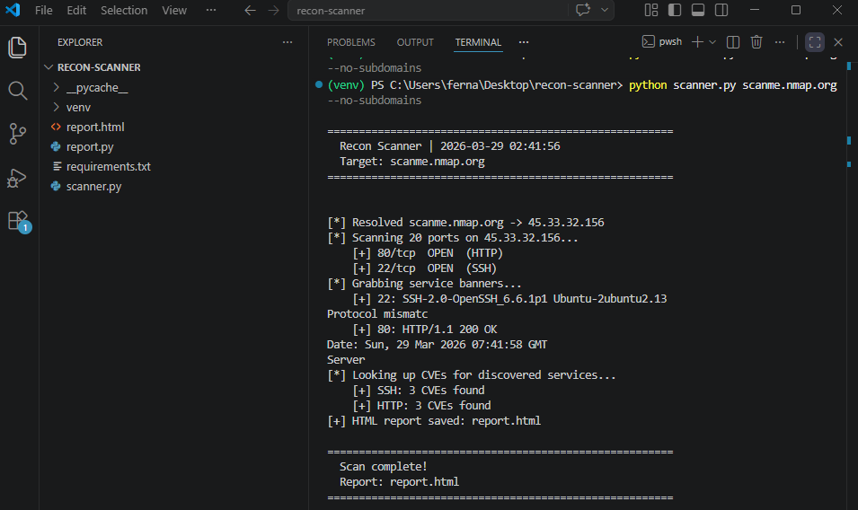
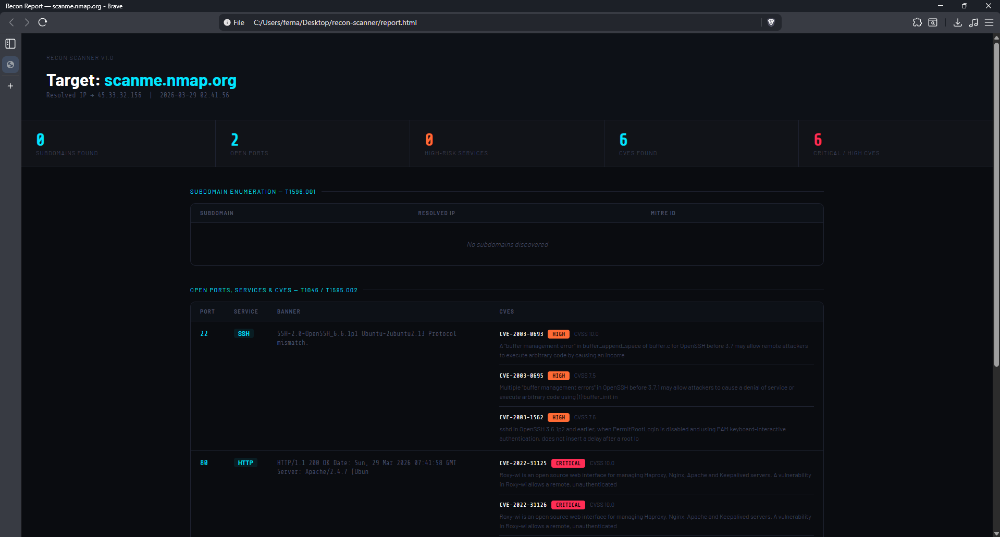
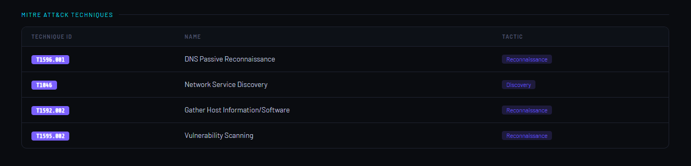

# 🔍 Automated Recon & Vulnerability Scanner

> Automated reconnaissance and vulnerability scanner that maps findings to **MITRE ATT&CK** and generates a polished HTML report.


---

## 📸 Screenshots

### Terminal Scan


### HTML Report


### MITRE ATT&CK Table


---

## 📋 Features

- **Subdomain Enumeration** — DNS brute-force + crt.sh certificate transparency logs
- **Port Scanning** — Multi-threaded scan of common ports
- **Banner Grabbing** — Service and version fingerprinting
- **CVE Lookup** — Real-time queries against NIST NVD API
- **MITRE ATT&CK Mapping** — All findings mapped to relevant techniques
- **HTML Report** — Styled dashboard with stats, tables, and CVE details

---

## 🧠 MITRE ATT&CK Coverage

| Technique ID | Name | Tactic |
|---|---|---|
| T1596.001 | DNS Passive Reconnaissance | Reconnaissance |
| T1046 | Network Service Discovery | Discovery |
| T1592.002 | Gather Host Information / Software | Reconnaissance |
| T1595.002 | Vulnerability Scanning | Reconnaissance |

---

## 📁 Project Structure
```
recon-scanner/
├── scanner.py        # Main entry point
├── report.py         # HTML report generator
├── requirements.txt  # Dependencies
└── README.md
```

## ⚙️ Installation
```bash
git clone https://github.com/cpt-ferna02/recon-scanner.git
cd recon-scanner
pip install -r requirements.txt
```

---

## 🚀 Usage
```bash
# Basic scan
python scanner.py example.com

# Skip subdomain enumeration (faster)
python scanner.py example.com --no-subdomains

# Skip CVE lookup
python scanner.py example.com --no-cve

# Custom output filename
python scanner.py example.com --output my_report
```

---

## ⚠️ Legal Disclaimer

> This tool is intended for **authorized security testing only**.
> Only run against systems you own or have **explicit written permission** to test.
> Unauthorized scanning may violate laws including the Computer Fraud and Abuse Act (CFAA).

---

## 🔗 Data Sources

- [NIST NVD](https://nvd.nist.gov/) — CVE database
- [crt.sh](https://crt.sh/) — Certificate transparency logs
- [MITRE ATT&CK](https://attack.mitre.org/) — Threat framework